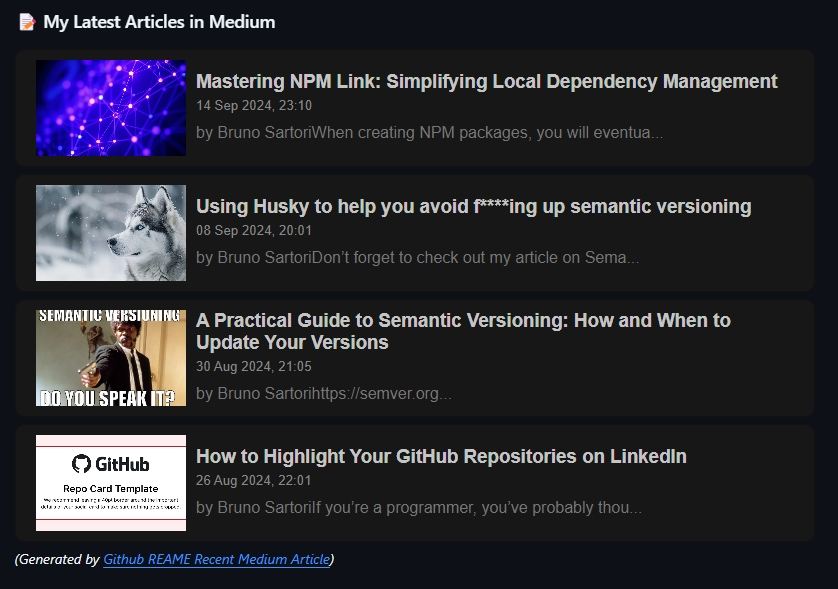

# Github REAME Recent Medium Article

Show your recent published article from Medium on your Readme. See the live [demo](https://github.com/bruno-sartori).



## Usage

Import this link in Readme as image source.

**Format:**
```bash
  https://github-medium-rss.vercel.app/medium/<medium-username>/<article-index>
```
- `medium-username`: your medium username/profile
- `article-index` : your recent article index. e.g: `0` means your latest article. 

#### Example
**Script in Readme.md**

```html
<a target="_blank" href="https://github-medium-rss.vercel.app/medium/@brunosartori.dev/0"> 

<a target="_blank" href="https://github-medium-rss.vercel.app/medium/@brunosartori.dev/2"> 

```
**Result**

<a target="_blank" href="https://github-medium-rss.vercel.app/medium/@brunosartori.dev/0">

<a target="_blank" href="https://github-medium-rss.vercel.app/medium/@brunosartori.dev/2">
